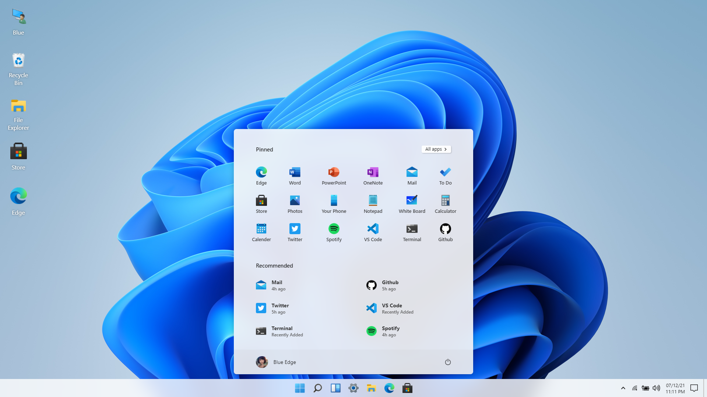
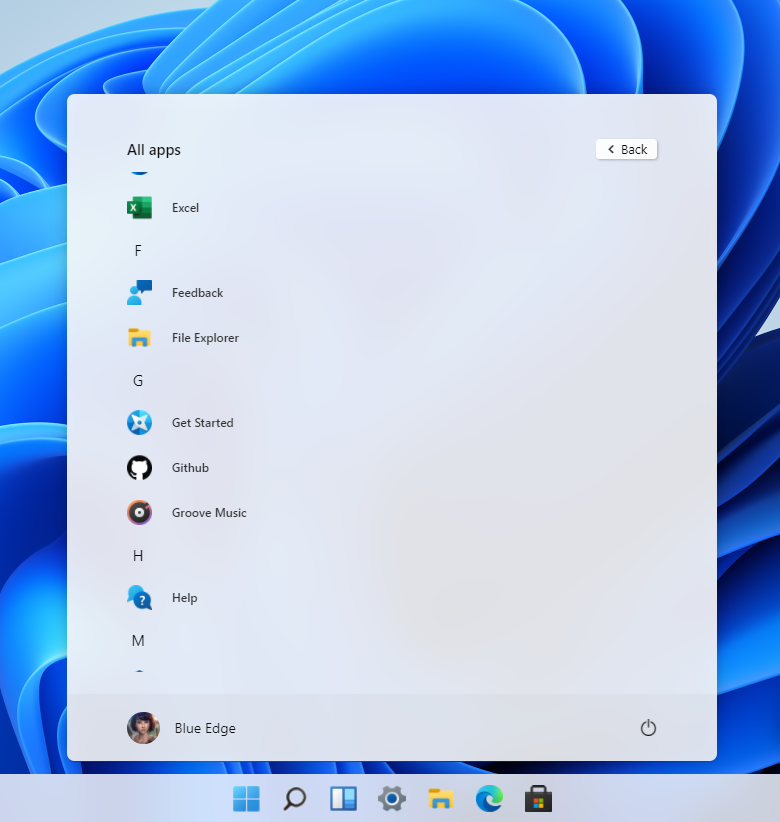
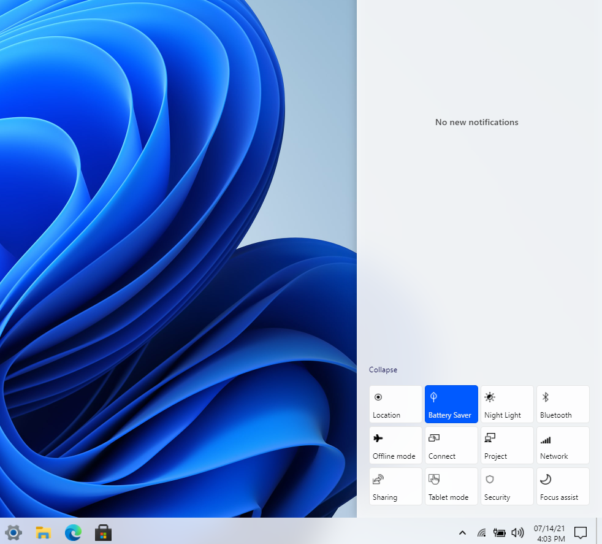
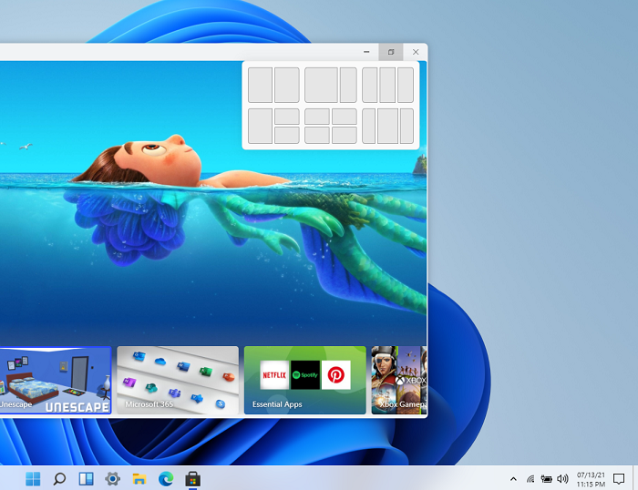
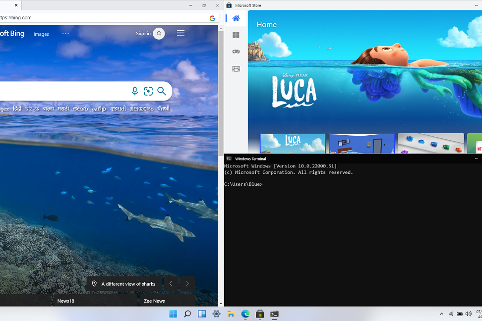
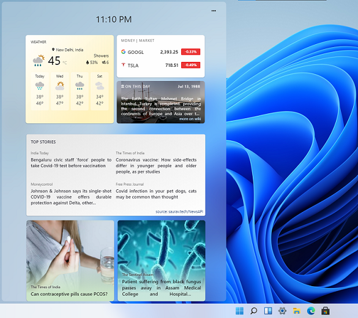

<h1 align="center">Windows 11 in React</h1>
 

### visit: [win11.blueedge.me](https://win11.blueedge.me)

 

     
    
    

 

    
    

 

### site: [win11.blueedge.me](https://win11.blueedge.me)

Check out the game 🎮 , **UNESCAPE** , I am working on [blueedge.me/unescape](https://blueedge.me/unescape)

[contact me](mailto:blueedgetechno@gmail.com) if you want to collab or make an issue for any upcoming update you want 
