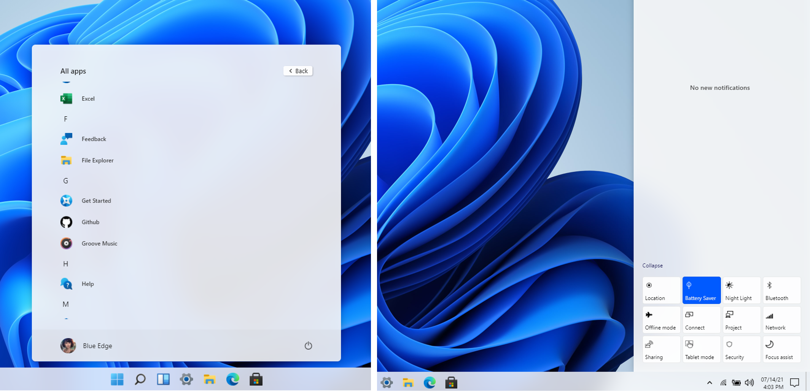
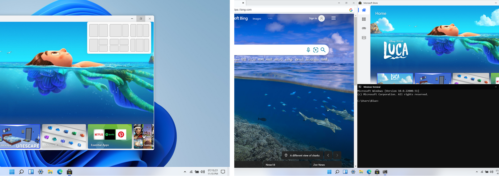

# Windows 11 in React

This open source project is made in the hope to replicate the Windows 11 desktop experience on web, using standard web technologies like React, CSS (SCSS), and Js.

 #### Live Experience🌈: [win11.blueedge.me](https://win11.blueedge.me)

# Gallery

# Why

WHY NOT? Why not just waste a week of your life creating a react project just to coverup your insecurities of how incompetent you are. Just Why not!

# Features
- [x] Start Menu, Search Menu and Widgets
- [x] Desktop and Right Click action
- [x] Side Navigation and Calendar View
- [x] Snap windows in different layouts
- [x] Browser, Store, Terminal, Calculator
- [x] Notepad, Vscode, Whiteboard
- [ ] File Explorer + other apps
- [ ] Drag and Resize windows
- [ ] Startup and Lock screen
- [ ] Themes and Background

📑 [suggest more](https://github.com/blueedgetechno/windows11/issues/new/choose)

# Stack

- Framework - React (^17.0.2) + Redux
- Component/UI Library - None!!
- Styling Solution - SCSS and CSS Modules (tailwind).
- Icons - fontawesome

## FAQ

- How long it took?
  - Honestly It took 2-3 days collecting assets, 2-3 planning and about 6 days programming it.

- Did you used any UI/Library?
  - No.

- Can I contribute?
  - Yes, you can! Open an issue, create a pull request, head over to [discussions](https://github.com/blueedgetechno/windows11/discussions) or join the [discord](https://discord.gg/Fz3Dkc4S).

- Where did you get the inspiration from, if you have?
  - I got the inspiration from [this youtube video](https://www.youtube.com/watch?v=OtOmxa9UMe8).

- What is the answer of Life, the Universe, and Everything?
  - 42

    

## License

⚖️ CC0-1.0 License
